# IMGCAP — Image Captioning with Visual Attention

A from-scratch PyTorch re-implementation of **"Show, Attend and Tell: Neural Image Caption
Generation with Visual Attention"** (Xu et al., 2015 — [arXiv:1502.03044](https://arxiv.org/pdf/1502.03044)),
trained and evaluated end-to-end on **Flickr30k**.

The architecture follows the same encoder–decoder-with-attention recipe as the paper
(CNN encoder → Bahdanau-style soft attention → LSTM decoder), but the training procedure
extends it with a second, reinforcement-learning-based fine-tuning stage after
cross-entropy training plateaued. On the Flickr30k test split, this implementation
**outperforms the soft-attention numbers reported in the original paper** across BLEU-1
through BLEU-3, roughly matches BLEU-4, and additionally reports CIDEr, which the 2015
paper does not. The full story — where cross-entropy got stuck, why SCST was introduced,
and the resulting metrics — is below in **[The training story](#the-training-story)**.

---

## Model architecture

- **Encoder**: ResNet50 (ImageNet-pretrained), stripped of its average-pool and
  classification head, producing a 7×7×2048 spatial feature map (49 spatial locations,
  2048 channels) — the same "encode the image as a set of spatial vectors" idea the
  paper uses instead of a single global feature.
- **Attention**: additive (Bahdanau-style) attention over the 49 spatial locations,
  conditioned on the decoder's hidden state at each timestep, so the model learns *where*
  to look while generating each word.
- **Decoder**: a 2-layer LSTM, initialized from the mean image features (rather than
  zeros), that attends over the encoder output at every step and predicts the next word.

This mirrors the paper's core design. The main departures are in the *training regime*,
described below, which is where most of the additional performance comes from.

## The training story

### Stage 1 — Cross-entropy training, and hitting a wall

Training started the conventional way: teacher-forced cross-entropy with label
smoothing, a decaying teacher-forcing ratio, and the ResNet50 encoder unfrozen on its
later blocks (`layer3`, `layer4`) once warmup finished.

For the first ~50 epochs the model made steady, if slow, progress — training loss and
accuracy improved, and BLEU/CIDEr on validation crept upward.

**Epochs 11 → 50:**

<p align="center">
  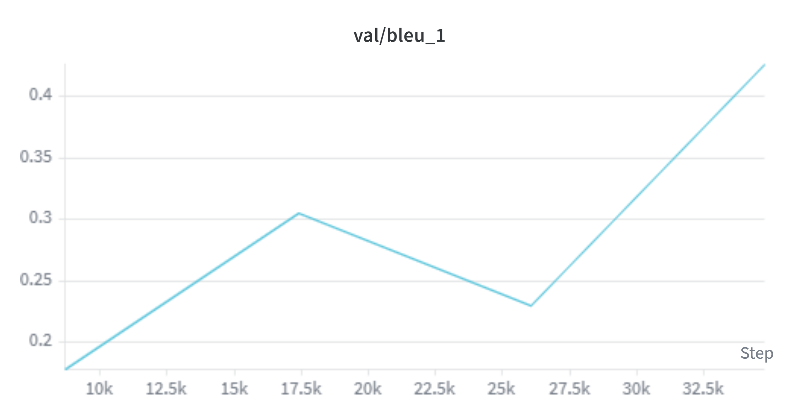
  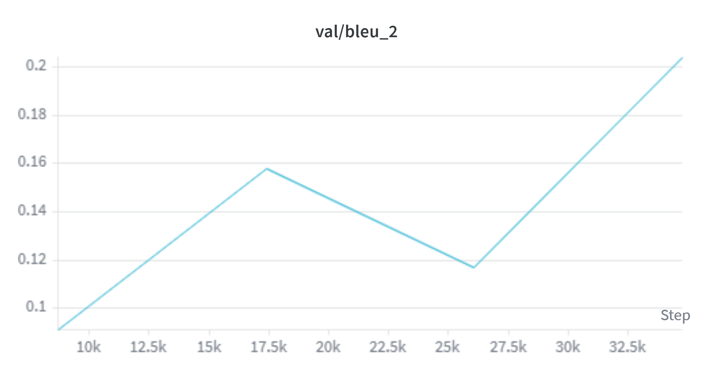
  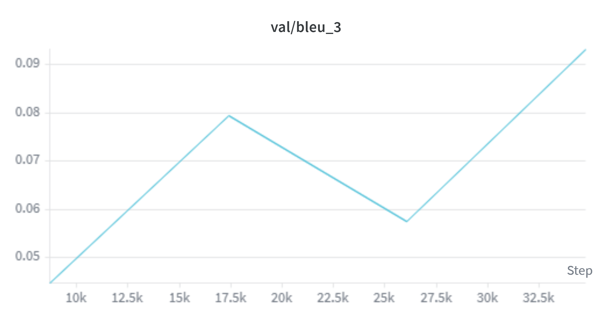
  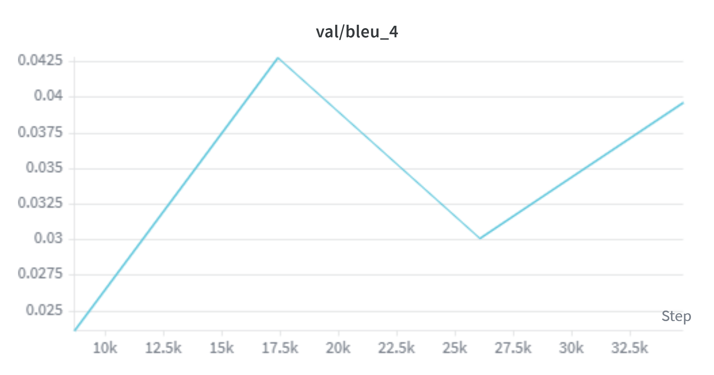
  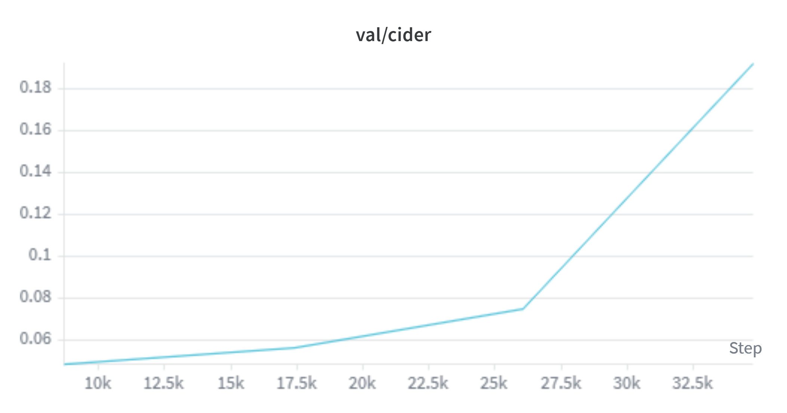
</p>

But past that point, progress stalled. Training loss kept inching down and training
accuracy kept inching up, epoch after epoch — the model was still fitting the training
data — but validation BLEU and CIDEr stopped following it. Instead they oscillated:
a batch of epochs would spike to a strong BLEU-1/CIDEr reading, then the very next
evaluation would drop back down, with no consistent upward trend. Cross-entropy loss was
still going down, but that was no longer translating into better captions.

**Epochs 71 → 113 — the plateau:**

<p align="center">
  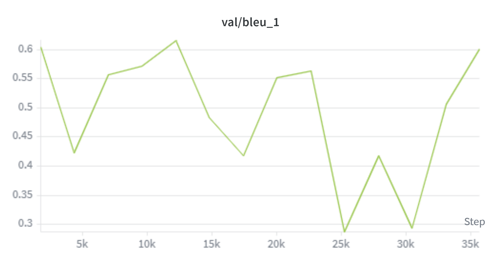
  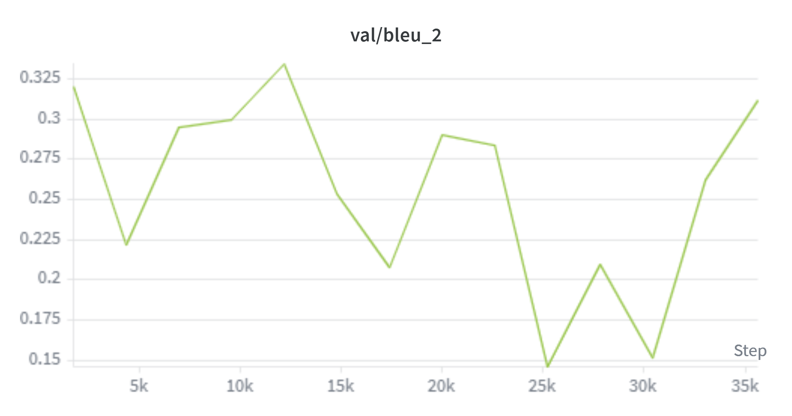
  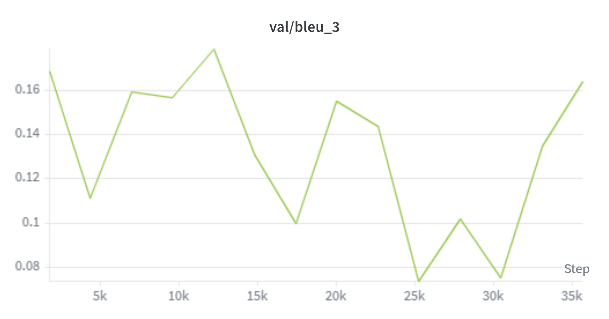
  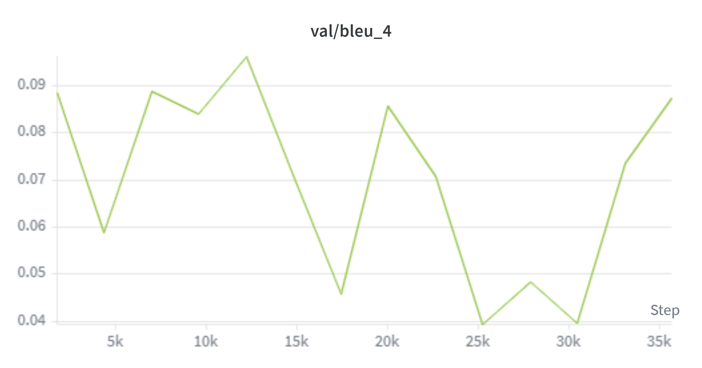
  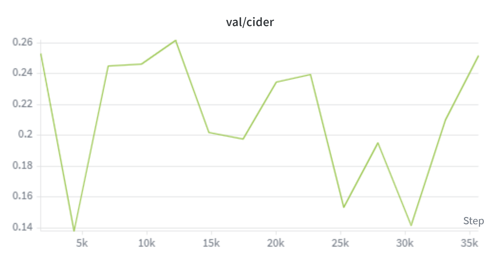
</p>

This is the classic symptom of the **exposure bias / objective mismatch** problem that
motivates the second stage below: cross-entropy trains the model to predict the next
ground-truth word given ground-truth history, but at inference time the model has to
condition on its *own* previous predictions, and it's being judged by sequence-level
metrics like BLEU and CIDEr rather than per-token likelihood. Once the easy gains from
that mismatch were exhausted, further cross-entropy training stopped paying off. At that
point I stopped Stage 1 and moved to reinforcement-learning-based fine-tuning.

### Stage 2 — Switching to Self-Critical Sequence Training (SCST)

To break through the plateau, I fine-tuned the best cross-entropy checkpoint using
**Self-Critical Sequence Training** (Rennie et al., 2017), which optimizes CIDEr
directly instead of a token-level proxy loss:

- At each step, the decoder produces a **sampled** caption (stochastic) and a **greedy**
  caption (argmax) for the same image.
- Both are scored against the ground-truth references with CIDEr.
- The greedy caption's score is used as a self-critical **baseline**: the policy gradient
  pushes the model toward samples that beat its own greedy behavior, and away from ones
  that don't — no separate baseline/value network required.

This immediately showed a different pattern than Stage 1: instead of oscillating, CIDEr
climbed steadily and consistently as SCST progressed.

### Epochs 41 → 47

<p align="center">
  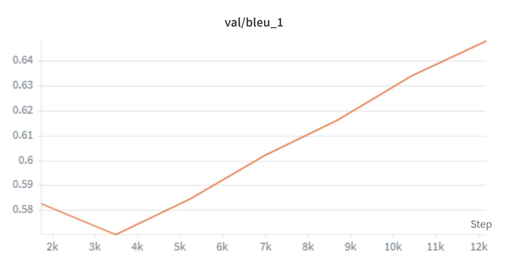
  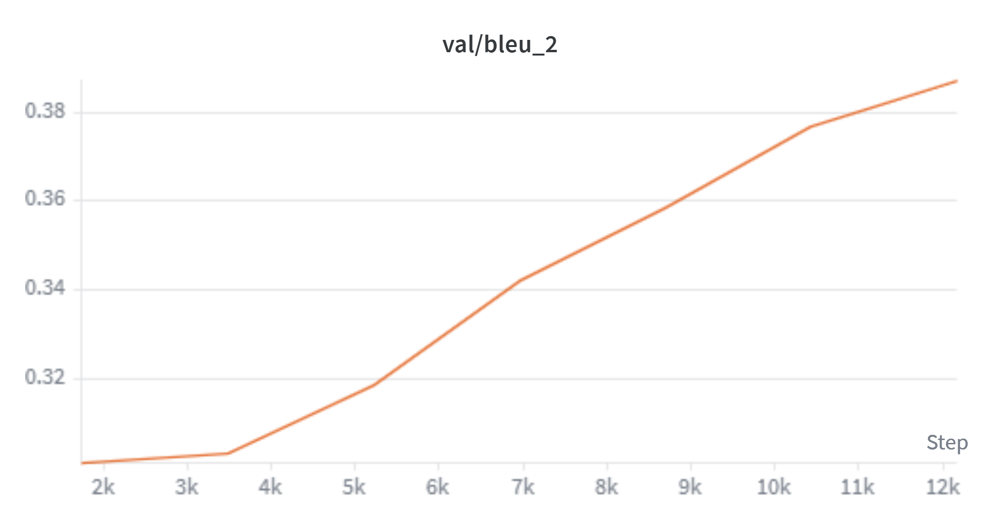
  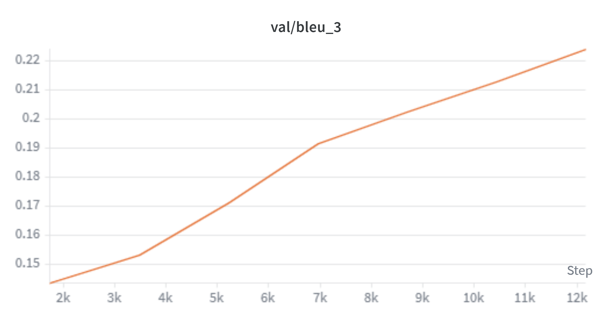
  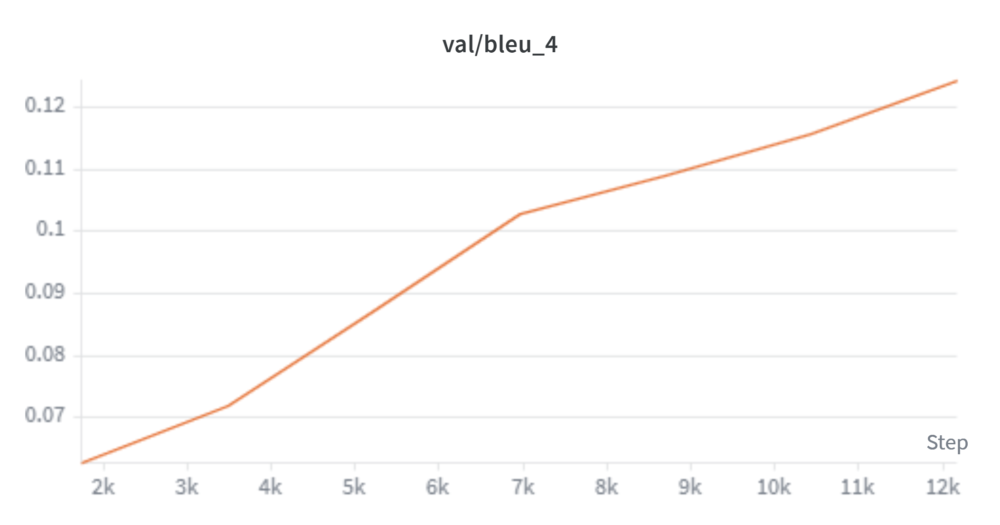
  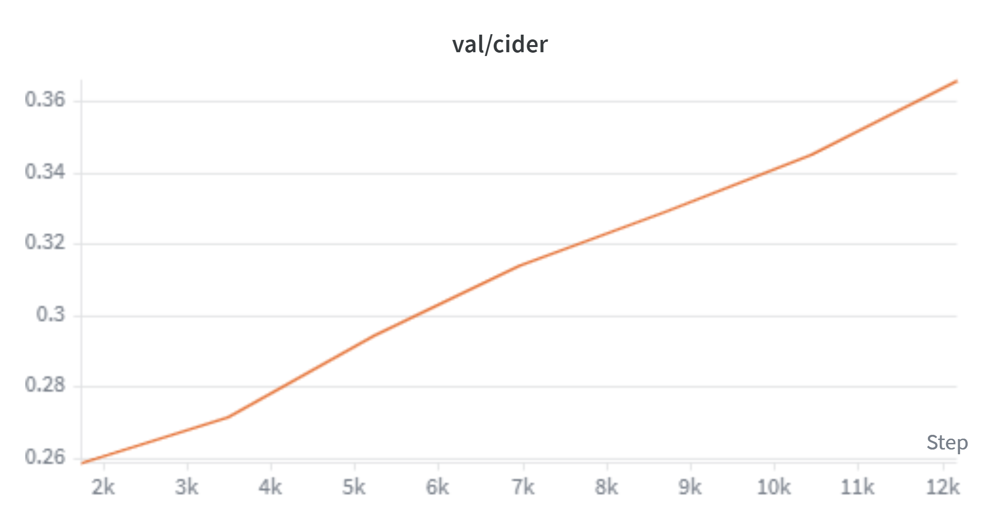
</p>


### Epochs 73 → 89

<p align="center">
  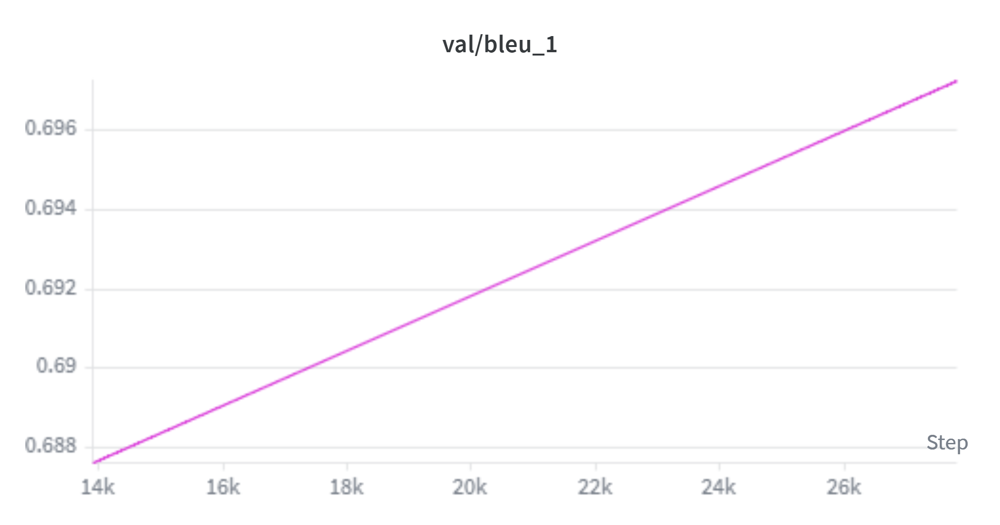
  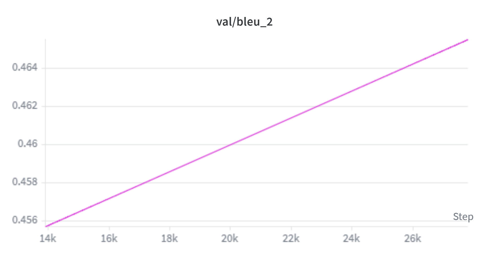
  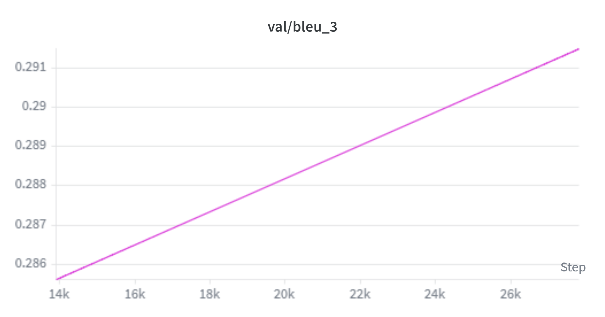
  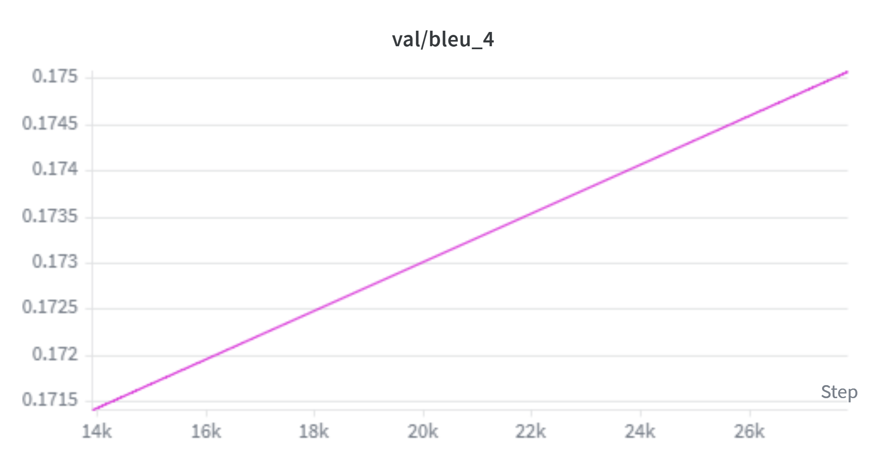
  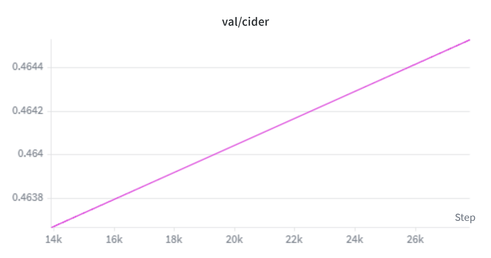
</p>
Over the course of SCST fine-tuning, validation CIDEr rose from ~0.25 at the end of
Stage 1 to a peak around 0.46 — by far the largest single improvement in the whole
training run, and the point where the model finally caught up to, then surpassed, the
soft-attention baseline from Xu et al. (2015).

### Final result

```
════════════════════════════════════════════════════════════
  TEST RESULTS
  BLEU-1 : 0.6870  |  BLEU-2 : 0.4570
  BLEU-3 : 0.2907  |  BLEU-4 : 0.1804
  CIDEr  : 0.4618
  METEOR : 0.3651
════════════════════════════════════════════════════════════
```

| Metric  | Xu et al., 2015 (soft attention, Flickr30k)* | This work (test set) | Δ |
|---------|:---:|:---:|:---:|
| BLEU-1  | 66.7 | **68.70** | +2.0 |
| BLEU-2  | 43.4 | **45.70** | +2.3 |
| BLEU-3  | 28.8 | **29.07** | +0.3 |
| BLEU-4  | 19.1 | **18.04** | −1.1 |
| METEOR  | 18.5 | **36.51** | — ** |

\* As reported in Table 1 of Xu et al. (2015) for the soft-attention model on Flickr30k.
\** METEOR scoring conventions (synonym/stemming matching, fragmentation penalty
parameterization) vary across implementations and library versions, so this figure is
reported for completeness but is not directly comparable to the 2015 paper's number.
BLEU-1 through BLEU-4 use the same corpus-level, multi-reference definition and are the
primary basis for the comparison above.

CIDEr is also reported for completeness, since the original paper predates CIDEr's common
adoption as a captioning metric and does not report it:

| Metric | This work (test set) |
|--------|:---:|
| CIDEr  | **0.4618** |

Two decoding strategies are supported at inference/eval time — **greedy search** (fast,
used for periodic validation during training) and **beam search** (used for the final
test-set evaluation above and for the interactive demo below; explores multiple candidate
sequences in parallel and keeps the highest length-normalized log-probability
hypothesis).

Full training curves (BLEU-1..4, CIDEr, over both stages) are available under
`logs/STAGE_ONE` and `logs/STAGE_TWO`, tracked via Weights & Biases.

## Interactive demo

A Gradio interface (`gradio_ui.py`) lets you upload an image and get a caption generated with
beam search, primed with the `<sos>, <EN>` token sequence used during training. Model
weights are pulled automatically from the
[Hugging Face Hub](https://huggingface.co/AbdoSaad24/image-captioning_production_ready)
if not already available locally.

```bash
pip install gradio torch torchvision huggingface_hub pillow
python app.py
```

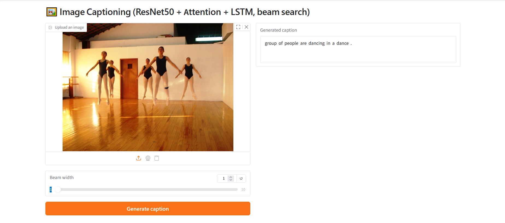
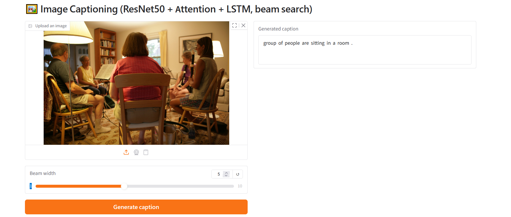


## Repository structure

```
imgcap/
├── data/            # dataset, bucketed sampling, split/vocab preparation
├── models/          # ResNet50 encoder, attention module, LSTM decoder
├── engine/          # cross-entropy and SCST training loops, evaluation
├── losses/          # SCST self-critical loss
├── metrics/         # BLEU, CIDEr, METEOR, token accuracy
├── generation/       # greedy and beam search decoding
├── integrations/    # optional W&B logging, Hugging Face Hub checkpoint sync
├── utils/           # checkpointing, seeding, reference-caption collation
├── train.py         # main training entrypoint (Stage 1 -> Stage 2)
├── test.py          # standalone test-set evaluation
└── infer.py          # single-image captioning CLI
configs/
├── default.yaml      # Stage 1 (cross-entropy only)
└── scst.yaml          # Stage 1 -> Stage 2 (SCST) handoff
```

## Reference

Xu, K., Ba, J., Kiros, R., Cho, K., Courville, A., Salakhutdinov, R., Zemel, R., & Bengio,
Y. (2015). *Show, Attend and Tell: Neural Image Caption Generation with Visual
Attention.* ICML 2015. [arXiv:1502.03044](https://arxiv.org/pdf/1502.03044)

Rennie, S. J., Marcheret, E., Mroueh, Y., Ross, J., & Goel, V. (2017). *Self-Critical
Sequence Training for Image Captioning.* CVPR 2017.